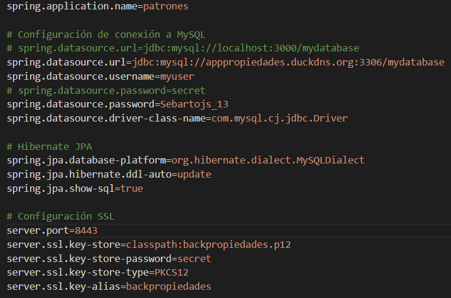
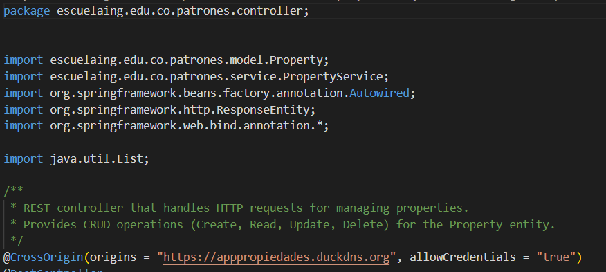
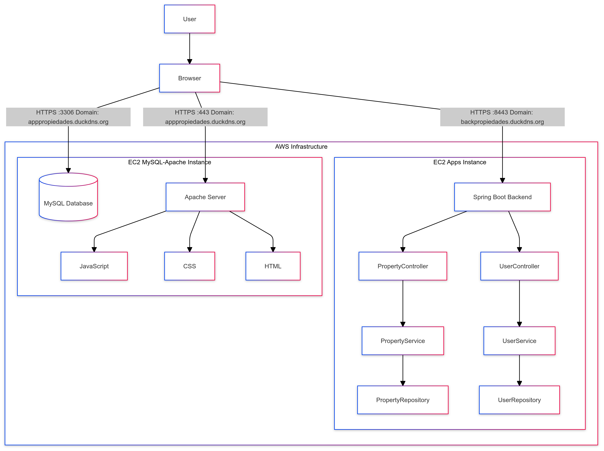

# Property Management Application with Spring Boot

This project implements a property management system using Spring Boot and JPA. It allows users to perform CRUD (Create, Read, Update, Delete) operations on properties. The system includes a RESTful API for managing properties and a simple web interface for user interaction.

<video controls src="images/execution.mp4" title="Title"></video>

## Getting Started

These instructions will help you get a copy of the project up and running on your local machine for development and testing purposes.

### Prerequisites

You need to install the following tools and configure their dependencies:

1. **Java** (versions 8 or higher)
    ```sh
    java -version
    ```
    Should return something like:
    ```sh
    java version "1.8.0"
    Java(TM) SE Runtime Environment (build 1.8.0-b132)
    Java HotSpot(TM) 64-Bit Server VM (build 25.0-b70, mixed mode)
    ```

2. **Maven**
    - Download Maven from [here](http://maven.apache.org/download.html)
    - Follow the installation instructions [here](http://maven.apache.org/download.html#Installation)

    Verify the installation:
    ```sh
    mvn -version
    ```
    Should return something like:
    ```sh
    Apache Maven 3.6.3 (cecedd343002696d0abb50b32b541b8a6ba2883f)
    Maven home: /usr/share/maven
    Java version: 1.8.0_241, vendor: Oracle Corporation
    Default locale: en_US, platform encoding: UTF-8
    ```

3. **Git**
    - Install Git by following the instructions [here](http://git-scm.com/book/en/v2/Getting-Started-Installing-Git)

    Verify the installation:
    ```sh
    git --version
    ```
    Should return something like:
    ```sh
    git version 2.25.1
    ```

## Installing

1. Clone the repository and navigate into the project directory:
    ```sh
    git clone https://github.com/Sebasvasquezz/-Architect-patterns.git
    cd -Architect-patterns
    ```

2. Build the project:
    ```sh
    mvn package
    ```

    This should generate a JAR file in the `target` directory.

3. Execute the docker compose file:
    ```sh
    docker-compose up -d
    ```
4. Run the application:
    ```sh
    java -jar target/patrones-0.0.1-SNAPSHOT.jar
    ```

    The application will start, and you can access the web interface at `https://localhost:8443`.

    

## Deploiment in AWS
To run the program on AWS, we need to have two instances:


In the instance called MySQL-Apache, MySQL and the Apache web server will be installed, and on the other instance, the Spring-boot app will be deployed. A Let's Encrypt certificate will be generated on each machine to implement the HTTPS protocol.

Two DNS domains are also needed for each EC2 instance in order to generate Let's Encrypt certificates. For this, the following website allows us to generate free domains: https://www.duckdns.org/.


* MySQL-Apache Instace - `apppropiedades.duckdns.org`

* Apps Instance - `backpropiedades.duckdns.org`

### Code changes:
In order to deploy the project on AWS with the requested architecture, it is necessary to make some changes to the code:
* application.properties:

* Property Controller:

* User Controller:

* Script.js:

* user.png:


### MySQL-Apache Instace
#### Install and run MySQL:
* Install package repository:
    ```sh
    sudo yum install https://dev.mysql.com/get/mysql57-community-release-el7-11.noarch.rpm
    ```
*  Manually import the MySQL GPG key:
    ```sh
    sudo rpm --import https://repo.mysql.com/RPM-GPG-KEY-mysql-2022
    ```
* Install MySQL:
    ```sh
    sudo yum install mysql-community-server -y
    ```
* Start service:
    ```sh
    sudo systemctl start mysqld
    ```
* Our user is created and given permissions, using MySQL commands and the remote access to our database is modified:
    
* Restart the service:
    ```sh
    sudo systemctl restart mysqld
    ```
#### Install and run Apache: 

* Connect to the EC2 instance.

    First, you must connect to the EC2 instance using SSH. Use the following command:

    ```bash
    ssh -i "path/to/your/key.pem" ec2-user@your-ip-address

    ```

*  Update the packages.
    ```bash
    sudo yum update -y
    ```

*  Install Apache.

    ```bash
    sudo yum install httpd -y
    ```

*  Start and enable Apache.

    Once installed, the Apache service must be started and configured to start automatically when the system boots.
    

    ```bash
    sudo systemctl start httpd
    sudo systemctl enable httpd
    ```


* Check the status of Apache:


    ```bash
    sudo systemctl status httpd
    ```

#### Let's Encrypt certificate

* Install Dependencies:

    To use Certbot, first, install Python and pip (a package manager for Python):

    ```bash
    sudo yum install python3-pip -y
    sudo pip3 install certbot

    ```
    You also need to install the Apache integration package:

     ```bash
    sudo yum install python-certbot-apache

    ```
*   Configure Apache

    Edit the configuration file for your virtual host for your domain:

    ```bash
    sudo nano /etc/httpd/conf.d/"your-domain".conf
    ```

    Make sure you have something like the following in your configuration file:

    ```bash
    <VirtualHost *:80>
        ServerName "your-domain"
        DocumentRoot /var/www/html
    </VirtualHost>
    ```


* Run Certbot

    Once the Apache configuration file is ready, you can run Certbot to obtain the SSL certificate:

    ```bash
    sudo certbot --apache -v -d "your-domain"
    ```

#### Upload frontend files

* Proceed to upload all the frontend files to the directory root using sftp.

    ```bash
    sftp -i "path/to/your/key.pem"ec2-user@your-ip-address
    ```
    ```bash
    put "file"
    ```
* Now, you have to move all the files to the correct directory:
    ```bash
    sudo mv "file" /var/www/html
    ```
### MySQL-Apache Instace

#### Let's Encrypt certificate
* Connect to the EC2 instance.

    First, you must connect to the EC2 instance using SSH. Use the following command:

    ```bash
    ssh -i "path/to/your/key.pem"ec2-user@your-ip-address
    ```
*  Install Certbot

    You can do so using the following commands:

    ```bash
    sudo yum update -y
    sudo yum install -y certbot python2-certbot-apache

    ```

*  Obtain a Let's Encrypt Certificate

    ```bash
    sudo certbot --apache -v -d "your-domain"

    ```


    This command will generate the certificate files, usually located in /etc/letsencrypt/live/your_domain.com/:

    + fullchain.pem: This is the certificate chain.
    + privkey.pem: This is the private key

*  Copy the certificates to a location accessible by Spring Boot

    ```bash
    sudo cp /etc/letsencrypt/live/"your-domain"/fullchain.pem /home/ec2-user/

    sudo cp /etc/letsencrypt/live/"your-domain"/privkey.pem /home/ec2-user/
    ```

*  Verify access permissions

    ```bash
    sudo chown ec2-user:ec2-user /home/ec2-user/privkey.pem
    sudo chmod 600 /home/ec2-user/privkey.pem

    sudo chown ec2-user:ec2-user /home/ec2-user/fullchain.pem
    sudo chmod 600 /home/ec2-user/fullchain.pem
    ```

* Convert the certificate to a PKCS12 format: Spring Boot requires a keystore in PKCS12 format.

    ```bash
    sudo yum install openssl -y
    ```

    ```bash
    openssl pkcs12 -export -in /home/ec2-user/fullchain.pem -inkey /home/ec2-user/privkey.pem \ -out /home/ec2-user/backpropiedades.p12 -name "backpropiedades" -password pass:secret
    ```

    ```bash
    sudo chown ec2-user:ec2-user /home/ec2-user/keystore.p12
    sudo chmod 600 /home/ec2-user/keystore.p12
    ```

#### Run the app:
* We upload the jar of our application to the other EC2 instance using sftp:
    

* Install java:
    ```sh
    sudo yum install java-17-amazon-corretto -y
    ```
* Execute the app with the command:
    ```sh
    java -jar patrones-0.0.1-SNAPSHOT
    ```
    The application will start, and you can access the web interface at `http://apppropiedades.duckdns.org:8443/`(The link may change over time) as shown in the initial video.

## Usage
The user interface allows users to manage property records. Below are the key features:

#### 1. Add Property

- **How to use it:** Fill in the property details (address, price, size, and description) and click "Add Property."
- **Expected behavior:** The property will be saved to the database, and it will appear in the list of properties.

#### 2. Edit Property

- **How to use it:** Click the "Edit" button next to a property in the list. The form will be pre-filled with the current property details. Make the desired changes and click "Update Property."
- **Expected behavior:** The property will be updated in the database.

#### 3. Delete Property

- **How to use it:** Click the "Delete" button next to a property in the list.
- **Expected behavior:** The property will be removed from the database.

## Tests
Run the tests with the command:

```sh
mvn test
```
Result:


**Mockito:** is used to simulate the behavior of dependencies (such as PropertyService in the controller or PropertyRepository in the service) without interacting with the real database.

**JUnit:** is used to run the tests and verify the expected behaviors.

In these tests: 
- **Controller:** We simulate the calls to the service methods and verify that the PropertyController REST methods work correctly.
- **Service:** We simulate the database access through the PropertyRepository and verify that the business logic is executed as expected, including exceptions.


## API Endpoints

The application provides the following RESTful API endpoints:

| Method   | Endpoint            | Description                    |
|----------|---------------------|--------------------------------|
| POST     | `/properties`        | Create a new property          |
| GET      | `/properties`        | Get all properties             |
| GET      | `/properties/{id}`   | Get a property by its ID       |
| PUT      | `/properties/{id}`   | Update a property by its ID    |
| DELETE   | `/properties/{id}`   | Delete a property by its ID    |
| POST     | `/api/users/register`   | Registers a new user     |
| POST     | `/api/users/authenticate`   | Authenticates a user by validating the username and password     |

## Architectural Diagram

This diagram represents the architecture of the system deployed across two AWS EC2 instances. The system is divided into two main components: one instance for hosting the Spring Boot backend and another for the Apache server and MySQL database. Below is a detailed description of the key components and their interactions:

### 1. **User Interaction**
   - **User**: Interacts with the system via a web browser.
   - **Browser**: Sends HTTPS requests to both the backend (Spring Boot) and the frontend (Apache server) hosted on separate EC2 instances.

### 2. **Frontend (EC2 MySQL-Apache Instance)**
   - This instance hosts both the Apache server and the MySQL database.
   - **MySQL Database**: Stores all persistent data such as user information, property data, and more. Accessible via the Apache server and Spring Boot backend.
   - **Apache Server**: Serves the frontend assets (HTML, CSS, and JavaScript) to the browser.
   - **Frontend Assets**:
     - **JavaScript**: Handles client-side logic and interactions.
     - **CSS**: Manages the styling of the frontend.
     - **HTML**: Provides the structure of the web pages served to the user.

### 3. **Backend (EC2 Apps Instance)**
   - This instance hosts the Spring Boot application, which handles business logic and API endpoints.
   - **Spring Boot Backend**: Processes user requests, performs CRUD operations, and manages business logic.
   - **PropertyController**: Handles HTTP requests related to properties, such as retrieving and updating property data.
   - **UserController**: Manages user-related operations like registration and authentication.
   - **PropertyService**: Contains the business logic for property management.
   - **UserService**: Contains the business logic for user management and authentication.
   - **PropertyRepository**: Interacts with the MySQL database to perform CRUD operations on property data.
   - **UserRepository**: Interacts with the MySQL database to handle user data operations.

### 4. **Communication**
   - **HTTPS Communication**:
     - The browser communicates with the Apache server via HTTPS on port 443 and with the backend via HTTPS on port 8443.
     - The backend communicates with the MySQL database on port 3306.

### 5. **Domain Information**
   - The following domains are used to access the services:
     - **apppropiedades.duckdns.org**: For accessing the Apache server and MySQL database.
     - **backpropiedades.duckdns.org**: For accessing the Spring Boot backend.

This architecture ensures separation of concerns by dividing the frontend and backend into different EC2 instances while leveraging a centralized MySQL database. The communication between the components is secured using HTTPS.

## Class Diagram


The class diagram represents the key components of the property management application and their interactions:

1. **PropertyController**: This is the REST controller that handles incoming HTTP requests related to properties. It provides endpoints for creating, reading, updating, and deleting properties. The methods in this class call the corresponding methods in the `PropertyService`.

   - `createProperty(Property property)`: Adds a new property to the system.
   - `getAllProperties()`: Retrieves a list of all properties.
   - `getPropertyById(Long id)`: Fetches a specific property by its ID.
   - `updateProperty(Long id, Property propertyDetails)`: Updates an existing property based on the given ID.
   - `deleteProperty(Long id)`: Deletes a property by its ID.

2. **PropertyService**: This class contains the business logic related to properties. It interacts with the `PropertyRepository` to perform the actual CRUD operations. The service is responsible for managing properties and ensures that the business rules are applied before data is saved or retrieved from the database.

   - `createProperty(Property property)`: Saves a new property to the database.
   - `getAllProperties()`: Retrieves all properties from the database.
   - `getPropertyById(Long id)`: Finds a specific property by its ID.
   - `updateProperty(Long id, Property propertyDetails)`: Updates a property's details.
   - `deleteProperty(Long id)`: Deletes a property from the database.

3. **PropertyRepository**: This interface extends Spring Data JPA's `JpaRepository` and provides the database access layer for the `Property` entity. It includes basic CRUD operations that interact with the database. Since it's an interface, Spring Data JPA generates the implementation automatically.

   - `save(Property property)`: Saves or updates a property in the database.
   - `findAll()`: Retrieves all properties from the database.
   - `findById(Long id)`: Finds a property by its ID.
   - `delete(Property property)`: Deletes a property from the database.

4. **Property**: This is the entity class representing the `Property` object in the system. It includes attributes like `id`, `address`, `price`, `size`, and `description`. This class is mapped to the database and is used by the repository for persistence.

   - `getId()`: Returns the ID of the property.
   - `setId(Long id)`: Sets the ID of the property.
   - `getAddress()`: Returns the address of the property.
   - `setAddress(String address)`: Sets the address of the property.
   - `getPrice()`: Returns the price of the property.
   - `setPrice(Double price)`: Sets the price of the property.
   - `getSize()`: Returns the size of the property.
   - `setSize(Double size)`: Sets the size of the property.
   - `getDescription()`: Returns the description of the property.
   - `setDescription(String description)`: Sets the description of the property.

The `PropertyController` interacts with the `PropertyService`, which in turn communicates with the `PropertyRepository` to handle database operations. The `Property` class serves as the data model that is stored and retrieved from the database.

1. **UserController**: This is the REST controller that manages user-related HTTP requests. It provides endpoints for user registration and authentication. The methods in this class delegate the business logic to the `UserService`.

   - `registerUser(User user)`: Registers a new user in the system.
   - `authenticate(User user)`: Authenticates a user and returns a token or response indicating successful login.

2. **UserService**: This class contains the business logic related to user management. It interacts with the `UserRepository` to perform CRUD operations on users. It handles tasks such as saving new users, loading user details for authentication, and verifying credentials.

   - `loadUserByUsername(String username)`: Retrieves user details needed for authentication by the username.
   - `save(User user)`: Saves a new user to the database.
   - `authenticate(String username, String rawPassword)`: Verifies the username and password for authentication.

3. **UserRepository**: This interface extends Spring Data JPA's `JpaRepository` and provides the data access layer for the `User` entity. It includes methods to find users by their username. The implementation is automatically provided by Spring Data JPA.

   - `findByUsername(String username)`: Finds a user in the database by their username.

4. **User**: This is the entity class that represents a user in the system. It includes attributes like `id`, `username`, and `password`. This class is mapped to the database and is used by the repository for persistence.

   - `getId()`: Returns the ID of the user.
   - `setId(Long id)`: Sets the ID of the user.
   - `getUsername()`: Returns the username of the user.
   - `setUsername(String username)`: Sets the username of the user.
   - `getPassword()`: Returns the password of the user.
   - `setPassword(String password)`: Sets the password of the user.

The `UserController` interacts with the `UserService`, which then communicates with the `UserRepository` to manage users in the database. The `User` class serves as the data model that is persisted and retrieved during the authentication and registration processes.


### Docker Compose Configuration

The following `docker-compose.yml` file configures the instance and properties of MySQL data base:

```yaml
services:
  mysql:
    container_name: 'guide-mysql'
    image: 'mysql:latest'
    environment:
      - 'MYSQL_DATABASE=mydatabase'
      - 'MYSQL_PASSWORD=secret'
      - 'MYSQL_ROOT_PASSWORD=verysecret'
      - 'MYSQL_USER=myuser'
    ports:
      - '3000:3306'

```
### Verifying Execution

To verify that all containers are running correctly on the virtual machine, the following command was used:

```sh
docker ps
```


## Built With

* [Maven](https://maven.apache.org/) - Dependency Management
* [Git](http://git-scm.com/) - Version Control System
* [Docker](https://www.docker.com) - Containerization and deployment.
* [MySQL](https://www.mysql.com/) - MySQL database. 

## Versioning

I use [GitHub](https://github.com/) for versioning. For the versions available, see the [tags on this repository](https://github.com/Sebasvasquezz/-Architect-patterns.git).

## Authors

* **Juan Sebastian Vasquez Vega**  - [Sebasvasquezz](https://github.com/Sebasvasquezz)

## Date

October 16, 2024

## License

This project is licensed under the GNU License - see the [LICENSE.txt](LICENSE.txt) file for details.
