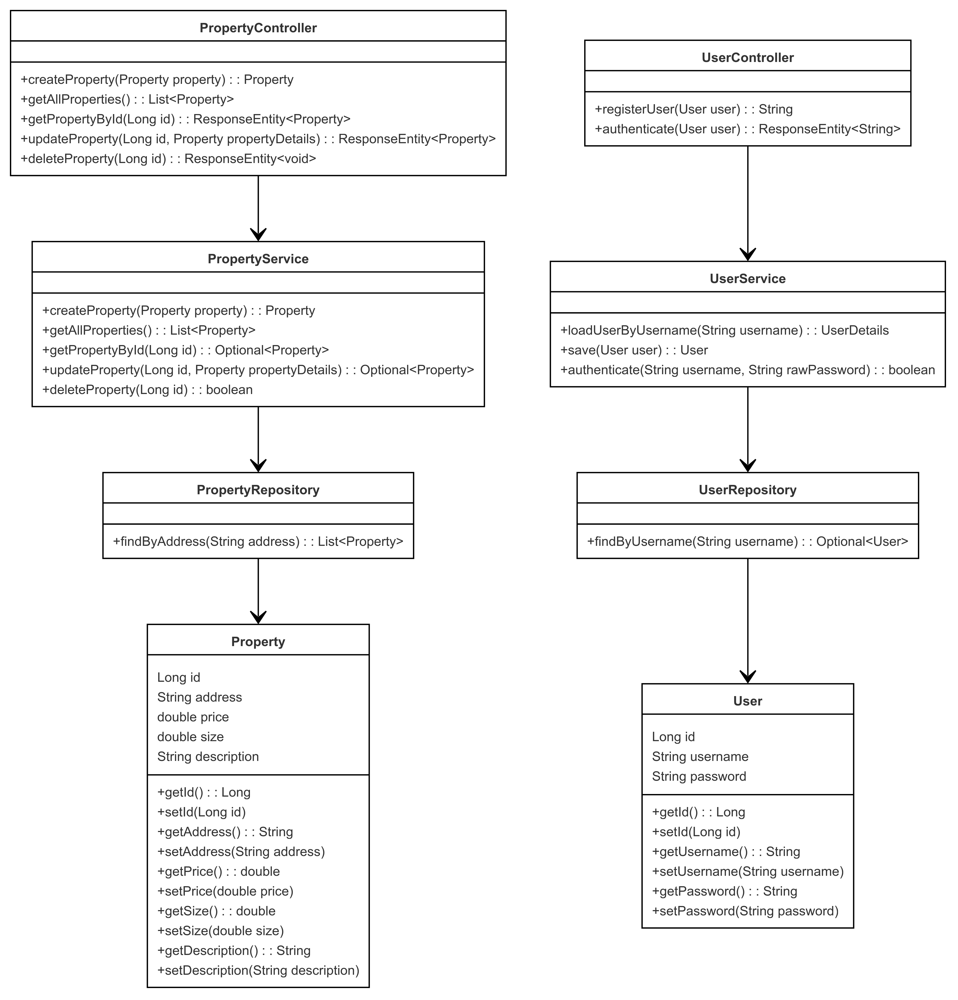

# Property Management Application with Spring Boot

This project implements a property management system using Spring Boot and JPA. It allows users to perform CRUD (Create, Read, Update, Delete) operations on properties. The system includes a RESTful API for managing properties and a simple web interface for user interaction.

## Getting Started

These instructions will help you get a copy of the project up and running on your local machine for development and testing purposes.

### Prerequisites

You need to install the following tools and configure their dependencies:

1. **Java** (versions 8 or higher)
    ```sh
    java -version
    ```
    Should return something like:
    ```sh
    java version "1.8.0"
    Java(TM) SE Runtime Environment (build 1.8.0-b132)
    Java HotSpot(TM) 64-Bit Server VM (build 25.0-b70, mixed mode)
    ```

2. **Maven**
    - Download Maven from [here](http://maven.apache.org/download.html)
    - Follow the installation instructions [here](http://maven.apache.org/download.html#Installation)

    Verify the installation:
    ```sh
    mvn -version
    ```
    Should return something like:
    ```sh
    Apache Maven 3.6.3 (cecedd343002696d0abb50b32b541b8a6ba2883f)
    Maven home: /usr/share/maven
    Java version: 1.8.0_241, vendor: Oracle Corporation
    Default locale: en_US, platform encoding: UTF-8
    ```

3. **Git**
    - Install Git by following the instructions [here](http://git-scm.com/book/en/v2/Getting-Started-Installing-Git)

    Verify the installation:
    ```sh
    git --version
    ```
    Should return something like:
    ```sh
    git version 2.25.1
    ```

## Installing

1. Clone the repository and navigate into the project directory:
    ```sh
    git clone https://github.com/Sebasvasquezz/-Architect-patterns.git
    cd -Architect-patterns
    ```

2. Build the project:
    ```sh
    mvn package
    ```

    This should generate a JAR file in the `target` directory.

3. Execute the docker compose file:
    ```sh
    docker-compose up -d
    ```
4. Run the application:
    ```sh
    java -jar target/patrones-0.0.1-SNAPSHOT.jar
    ```

    The application will start, and you can access the web interface at `http://localhost:8080`.

    

## Deploiment in AWS
In order to deploy the project on AWS with the requested architecture, it is necessary to make some changes to the code:
* application.properties:

* Property Controller:

### Install and run MySQL:
* Install package repository:
    ```sh
    sudo yum install https://dev.mysql.com/get/mysql57-community-release-el7-11.noarch.rpm
    ```
*  Manually import the MySQL GPG key:
    ```sh
    sudo rpm --import https://repo.mysql.com/RPM-GPG-KEY-mysql-2022
    ```
* Install MySQL:
    ```sh
    sudo yum install mysql-community-server -y
    ```
* Start service:
    ```sh
    sudo systemctl start mysqld
    ```
* Our user is created and given permissions, using MySQL commands and the remote access to our database is modified:
    
* Restart the service:
    ```sh
    sudo systemctl restart mysqld
    ```
### Run the app:
* We upload the jar of our application to the other EC2 instance using sftp:
    

* Install java:
    ```sh
    sudo yum install java-17-amazon-corretto -y
    ```
* Execute the app with the command:
    ```sh
    java -jar patrones-0.0.1-SNAPSHOT
    ```
    The application will start, and you can access the web interface at `http://54.145.132.193:8080/`(The link may change over time).

    
## Usage

The user interface allows users to manage property records. Below are the key features:

#### 1. Add Property

- **How to use it:** Fill in the property details (address, price, size, and description) and click "Add Property."
- **Expected behavior:** The property will be saved to the database, and it will appear in the list of properties.

#### 2. Edit Property

- **How to use it:** Click the "Edit" button next to a property in the list. The form will be pre-filled with the current property details. Make the desired changes and click "Update Property."
- **Expected behavior:** The property will be updated in the database.

#### 3. Delete Property

- **How to use it:** Click the "Delete" button next to a property in the list.
- **Expected behavior:** The property will be removed from the database.

## Tests
Run the tests with the command:

```sh
mvn test
```
Result:


**Mockito:** is used to simulate the behavior of dependencies (such as PropertyService in the controller or PropertyRepository in the service) without interacting with the real database.

**JUnit:** is used to run the tests and verify the expected behaviors.

In these tests: 
- **Controller:** We simulate the calls to the service methods and verify that the PropertyController REST methods work correctly.
- **Service:** We simulate the database access through the PropertyRepository and verify that the business logic is executed as expected, including exceptions.


## API Endpoints

The application provides the following RESTful API endpoints:

| Method   | Endpoint            | Description                    |
|----------|---------------------|--------------------------------|
| POST     | `/properties`        | Create a new property          |
| GET      | `/properties`        | Get all properties             |
| GET      | `/properties/{id}`   | Get a property by its ID       |
| PUT      | `/properties/{id}`   | Update a property by its ID    |
| DELETE   | `/properties/{id}`   | Delete a property by its ID    |

## Architectural Diagram

This project follows a standard MVC (Model-View-Controller) architecture:

1. **Controller**: Handles incoming HTTP requests and sends responses.
2. **Service**: Encapsulates business logic and interacts with the repository.
3. **Repository**: Manages data persistence using Spring Data JPA.
4. **Model**: Represents the entity (Property) that is mapped to a database table.

### Overview

- **PropertyController**: Handles API requests for managing properties.
- **PropertyService**: Provides business logic for creating, reading, updating, and deleting properties.
- **PropertyRepository**: Interface for CRUD operations on the `Property` entity, leveraging Spring Data JPA.
- **Property**: Entity class representing a property in the system, including attributes such as address, price, size, and description.

## Class Diagram



The class diagram represents the key components of the property management application and their interactions:

1. **PropertyController**: This is the REST controller that handles incoming HTTP requests related to properties. It provides endpoints for creating, reading, updating, and deleting properties. The methods in this class call the corresponding methods in the `PropertyService`.

   - `createProperty(Property property)`: Adds a new property to the system.
   - `getAllProperties()`: Retrieves a list of all properties.
   - `getPropertyById(Long id)`: Fetches a specific property by its ID.
   - `updateProperty(Long id, Property propertyDetails)`: Updates an existing property based on the given ID.
   - `deleteProperty(Long id)`: Deletes a property by its ID.

2. **PropertyService**: This class contains the business logic related to properties. It interacts with the `PropertyRepository` to perform the actual CRUD operations. The service is responsible for managing properties and ensures that the business rules are applied before data is saved or retrieved from the database.

   - `createProperty(Property property)`: Saves a new property to the database.
   - `getAllProperties()`: Retrieves all properties from the database.
   - `getPropertyById(Long id)`: Finds a specific property by its ID.
   - `updateProperty(Long id, Property propertyDetails)`: Updates a property's details.
   - `deleteProperty(Long id)`: Deletes a property from the database.

3. **PropertyRepository**: This interface extends Spring Data JPA's `JpaRepository` and provides the database access layer for the `Property` entity. It includes basic CRUD operations that interact with the database. Since it's an interface, Spring Data JPA generates the implementation automatically.

   - `save(Property property)`: Saves or updates a property in the database.
   - `findAll()`: Retrieves all properties from the database.
   - `findById(Long id)`: Finds a property by its ID.
   - `delete(Property property)`: Deletes a property from the database.

4. **Property**: This is the entity class representing the `Property` object in the system. It includes attributes like `id`, `address`, `price`, `size`, and `description`. This class is mapped to the database and is used by the repository for persistence.

   - `getId()`: Returns the ID of the property.
   - `setId(Long id)`: Sets the ID of the property.
   - `getAddress()`: Returns the address of the property.
   - `setAddress(String address)`: Sets the address of the property.
   - `getPrice()`: Returns the price of the property.
   - `setPrice(Double price)`: Sets the price of the property.
   - `getSize()`: Returns the size of the property.
   - `setSize(Double size)`: Sets the size of the property.
   - `getDescription()`: Returns the description of the property.
   - `setDescription(String description)`: Sets the description of the property.

The `PropertyController` interacts with the `PropertyService`, which in turn communicates with the `PropertyRepository` to handle database operations. The `Property` class serves as the data model that is stored and retrieved from the database.


### Docker Compose Configuration

The following `docker-compose.yml` file configures the instance and properties of MySQL data base:

```yaml
services:
  mysql:
    container_name: 'guide-mysql'
    image: 'mysql:latest'
    environment:
      - 'MYSQL_DATABASE=mydatabase'
      - 'MYSQL_PASSWORD=secret'
      - 'MYSQL_ROOT_PASSWORD=verysecret'
      - 'MYSQL_USER=myuser'
    ports:
      - '3000:3306'

```
### Verifying Execution

To verify that all containers are running correctly on the virtual machine, the following command was used:

```sh
docker ps
```


## Built With

* [Maven](https://maven.apache.org/) - Dependency Management
* [Git](http://git-scm.com/) - Version Control System
* [Docker](https://www.docker.com) - Containerization and deployment.
* [MySQL](https://www.mysql.com/) - MySQL database. 

## Versioning

I use [GitHub](https://github.com/) for versioning. For the versions available, see the [tags on this repository](https://github.com/Sebasvasquezz/-Architect-patterns.git).

## Authors

* **Juan Sebastian Vasquez Vega**  - [Sebasvasquezz](https://github.com/Sebasvasquezz)

## Date

September 30, 2024

## License

This project is licensed under the GNU License - see the [LICENSE.txt](LICENSE.txt) file for details.
